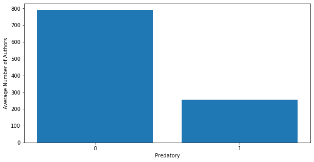
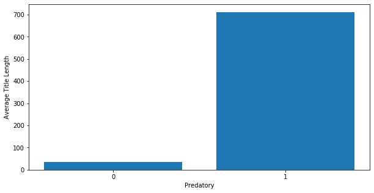
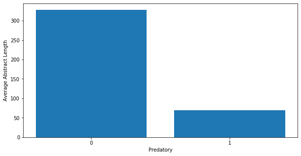

```python
import seaborn as sns
import pandas as pd
import numpy as np
import matplotlib.pyplot as plt
%matplotlib inline
```


```python
df_cs = pd.read_csv('scraped_arXiv/data/df_cs.csv', index_col=0)
```


```python
df_math = pd.read_csv('scraped_arXiv/data/df_math.csv', index_col=0)
```


```python
df_econ = pd.read_csv('scraped_arXiv/data/df_econ.csv', index_col=0)
```


```python
df_eess = pd.read_csv('scraped_arXiv/data/df_eess.csv', index_col=0)
```


```python
list_legit = [df_cs, df_math, df_econ, df_eess] 
df_legit = pd.concat(list_legit)
df_legit.shape
```


    (8014, 4)


```python
df_legit.drop(['categories'],axis=1,inplace=True)
df_legit['Predatory'] = 0
```


<div>
<style scoped>
    .dataframe tbody tr th:only-of-type {
        vertical-align: middle;
    }

    .dataframe tbody tr th {
        vertical-align: top;
    }

    .dataframe thead th {
        text-align: right;
    }
</style>
<table border="1" class="dataframe">
  <thead>
    <tr style="text-align: right;">
      <th></th>
      <th>title</th>
      <th>abstract</th>
      <th>authors</th>
      <th>Predatory</th>
    </tr>
  </thead>
  <tbody>
    <tr>
      <td>0</td>
      <td>a rank-metric approach to error control in ran...</td>
      <td>the problem of error control in random linear ...</td>
      <td>['danilo silva', 'frank r. kschischang', 'ralf...</td>
      <td>0</td>
    </tr>
    <tr>
      <td>1</td>
      <td>on metrics for error correction in network coding</td>
      <td>the problem of error correction in both cohere...</td>
      <td>['danilo silva', 'frank r. kschischang']</td>
      <td>0</td>
    </tr>
    <tr>
      <td>2</td>
      <td>communication over finite-field matrix channels</td>
      <td>this paper is motivated by the problem of erro...</td>
      <td>['danilo silva', 'frank r. kschischang', 'ralf...</td>
      <td>0</td>
    </tr>
    <tr>
      <td>3</td>
      <td>universal secure network coding via rank-metri...</td>
      <td>the problem of securing a network coding commu...</td>
      <td>['danilo silva', 'frank r. kschischang']</td>
      <td>0</td>
    </tr>
    <tr>
      <td>4</td>
      <td>robust network coding in the presence of untru...</td>
      <td>while network coding can be an efficient means...</td>
      <td>['da wang', 'danilo silva', 'frank r. kschisch...</td>
      <td>0</td>
    </tr>
  </tbody>
</table>
</div>


```python
df_pred = pd.read_csv('scraped_arXiv/data/predj.csv', index_col=0)
```


```python
df_pred.drop(['Journal'], axis=1, inplace=True)
df_pred.columns = ['title', 'abstract', 'authors', 'Predatory']
```


```python
df_pred.head()
```


<div>
<style scoped>
    .dataframe tbody tr th:only-of-type {
        vertical-align: middle;
    }

    .dataframe tbody tr th {
        vertical-align: top;
    }

    .dataframe thead th {
        text-align: right;
    }
</style>
<table border="1" class="dataframe">
  <thead>
    <tr style="text-align: right;">
      <th></th>
      <th>title</th>
      <th>abstract</th>
      <th>authors</th>
      <th>Predatory</th>
    </tr>
  </thead>
  <tbody>
    <tr>
      <td>0</td>
      <td>In communication networks, congestion occurs w...</td>
      <td>Banshri Raichana, Sangeeeta Kulkarni</td>
      <td>Performance measurement of computer networks t...</td>
      <td>1</td>
    </tr>
    <tr>
      <td>1</td>
      <td>As network attacks have increased in number an...</td>
      <td>Fiona Lowden Lawrence, Sanjay Kumar Sharma, Ma...</td>
      <td>Network Intrusion detection by using Feature R...</td>
      <td>1</td>
    </tr>
    <tr>
      <td>2</td>
      <td>Due to the rapid technological progress, the c...</td>
      <td>Dr. K.T. Chaturvedi, Rohit Kumar Gupta</td>
      <td>An approach towards FACTS Devices Installation...</td>
      <td>1</td>
    </tr>
    <tr>
      <td>3</td>
      <td>Speech synthesizer is the artificial producti...</td>
      <td>Mrs.J. P. Kshirsagar, Prof. G. G. Chiddarwar</td>
      <td>Language Translator and Synthesizer for Mobile</td>
      <td>1</td>
    </tr>
    <tr>
      <td>4</td>
      <td>This paper presents a Angle Stability Solution...</td>
      <td>Dr. K.T. Chaturvedi, Kripashankar Pandeya</td>
      <td>A study on Angle Stability Solution Using coor...</td>
      <td>1</td>
    </tr>
  </tbody>
</table>
</div>


```python
df = pd.concat([df_legit, df_pred])
df.head()
```


<div>
<style scoped>
    .dataframe tbody tr th:only-of-type {
        vertical-align: middle;
    }

    .dataframe tbody tr th {
        vertical-align: top;
    }

    .dataframe thead th {
        text-align: right;
    }
</style>
<table border="1" class="dataframe">
  <thead>
    <tr style="text-align: right;">
      <th></th>
      <th>title</th>
      <th>abstract</th>
      <th>authors</th>
      <th>Predatory</th>
    </tr>
  </thead>
  <tbody>
    <tr>
      <td>0</td>
      <td>a rank-metric approach to error control in ran...</td>
      <td>the problem of error control in random linear ...</td>
      <td>['danilo silva', 'frank r. kschischang', 'ralf...</td>
      <td>0</td>
    </tr>
    <tr>
      <td>1</td>
      <td>on metrics for error correction in network coding</td>
      <td>the problem of error correction in both cohere...</td>
      <td>['danilo silva', 'frank r. kschischang']</td>
      <td>0</td>
    </tr>
    <tr>
      <td>2</td>
      <td>communication over finite-field matrix channels</td>
      <td>this paper is motivated by the problem of erro...</td>
      <td>['danilo silva', 'frank r. kschischang', 'ralf...</td>
      <td>0</td>
    </tr>
    <tr>
      <td>3</td>
      <td>universal secure network coding via rank-metri...</td>
      <td>the problem of securing a network coding commu...</td>
      <td>['danilo silva', 'frank r. kschischang']</td>
      <td>0</td>
    </tr>
    <tr>
      <td>4</td>
      <td>robust network coding in the presence of untru...</td>
      <td>while network coding can be an efficient means...</td>
      <td>['da wang', 'danilo silva', 'frank r. kschisch...</td>
      <td>0</td>
    </tr>
  </tbody>
</table>
</div>


```python
def numberauthors(df):
    df['number_authors'] = df.authors.apply(lambda x: len(x))
```


```python
numberauthors(df)
```


```python
df
```


<div>
<style scoped>
    .dataframe tbody tr th:only-of-type {
        vertical-align: middle;
    }

    .dataframe tbody tr th {
        vertical-align: top;
    }

    .dataframe thead th {
        text-align: right;
    }
</style>
<table border="1" class="dataframe">
  <thead>
    <tr style="text-align: right;">
      <th></th>
      <th>title</th>
      <th>abstract</th>
      <th>authors</th>
      <th>Predatory</th>
      <th>number_authors</th>
    </tr>
  </thead>
  <tbody>
    <tr>
      <td>0</td>
      <td>a rank-metric approach to error control in ran...</td>
      <td>the problem of error control in random linear ...</td>
      <td>['danilo silva', 'frank r. kschischang', 'ralf...</td>
      <td>0</td>
      <td>55</td>
    </tr>
    <tr>
      <td>1</td>
      <td>on metrics for error correction in network coding</td>
      <td>the problem of error correction in both cohere...</td>
      <td>['danilo silva', 'frank r. kschischang']</td>
      <td>0</td>
      <td>40</td>
    </tr>
    <tr>
      <td>2</td>
      <td>communication over finite-field matrix channels</td>
      <td>this paper is motivated by the problem of erro...</td>
      <td>['danilo silva', 'frank r. kschischang', 'ralf...</td>
      <td>0</td>
      <td>55</td>
    </tr>
    <tr>
      <td>3</td>
      <td>universal secure network coding via rank-metri...</td>
      <td>the problem of securing a network coding commu...</td>
      <td>['danilo silva', 'frank r. kschischang']</td>
      <td>0</td>
      <td>40</td>
    </tr>
    <tr>
      <td>4</td>
      <td>robust network coding in the presence of untru...</td>
      <td>while network coding can be an efficient means...</td>
      <td>['da wang', 'danilo silva', 'frank r. kschisch...</td>
      <td>0</td>
      <td>51</td>
    </tr>
    <tr>
      <td>...</td>
      <td>...</td>
      <td>...</td>
      <td>...</td>
      <td>...</td>
      <td>...</td>
    </tr>
    <tr>
      <td>1923</td>
      <td>Stability is one of the most important concept...</td>
      <td>Unal Ufuktepe, Burcin Kulahcioglu</td>
      <td>Stability Analysis for Discrete Dynamical Mode...</td>
      <td>1</td>
      <td>66</td>
    </tr>
    <tr>
      <td>1924</td>
      <td>From the fundamental theorem of homomorphisms,...</td>
      <td>Gezahagne Mulat Addis</td>
      <td>Fundamental Theorem Of Functions</td>
      <td>1</td>
      <td>32</td>
    </tr>
    <tr>
      <td>1925</td>
      <td>The research presented in this article deals w...</td>
      <td>Khelifi Lamia, Bensalem Rafik, Semmar Djaffar</td>
      <td>Thermal and Airflow Characteristics of Transit...</td>
      <td>1</td>
      <td>156</td>
    </tr>
    <tr>
      <td>1926</td>
      <td>In this paper we are searching for teleparalle...</td>
      <td>Tariq Zaman Khan</td>
      <td>Killing Symmetry in Special Axially Symmetric ...</td>
      <td>1</td>
      <td>100</td>
    </tr>
    <tr>
      <td>1927</td>
      <td>The focus of the present work is concerned wit...</td>
      <td>Muhammad Ayaz, Taza Gul, Saeed Islam, Muhammad...</td>
      <td>Analysis of Ellis Fluid in Wire Coating</td>
      <td>1</td>
      <td>39</td>
    </tr>
  </tbody>
</table>
<p>9942 rows × 5 columns</p>
</div>


```python
plt.figure(figsize=(10,5))
plt.bar(df.Predatory,df.number_authors)
plt.xlabel('Predatory')
plt.xticks([0,1])
plt.ylabel('Average Number of Authors')
plt.show()
```





```python
def word_count(string):
    return len(string.split(" "))
```


```python
df.dtypes
```


    title             object
    abstract          object
    authors           object
    Predatory          int64
    number_authors     int64
    dtype: object


```python
df['title'] = df.title.astype(str)
df['title_wordcount'] = df.title.apply(word_count)
df['abstract_wordcount'] = df.abstract.apply(word_count)
```


```python
plt.figure(figsize=(10,5))
plt.bar(df.Predatory,df.title_wordcount)
plt.xlabel('Predatory')
plt.xticks([0,1])
plt.ylabel('Average Title Length')
plt.show()
```





```python
plt.figure(figsize=(10,5))
plt.bar(df.Predatory,df.abstract_wordcount)
plt.xlabel('Predatory')
plt.xticks([0,1])
plt.ylabel('Average Abstract Length')
plt.show()
```





***
# Text Analysis


```python
#NLTK Packages
import nltk
#nltk.download()
from nltk.corpus import stopwords
from nltk.tokenize import word_tokenize
from nltk.stem import WordNetLemmatizer
import string
```


```python
def tokenizer(text):
    tokenized_text = word_tokenize(text)
    return tokenized_text

######

stop_words = stopwords.words('english')

def stop_words_remover(tokenized_text):
    stop_words_removed = []

    for token in tokenized_text:
        if token in stop_words:
            continue
        else:
            stop_words_removed.append(token)
    return stop_words_removed

######

def lemmatizer(stop_words_removed):
    lemmatized_tokens = []
    
    for token in stop_words_removed:
        lemmatized_token = WordNetLemmatizer().lemmatize(token)
        lemmatized_tokens.append(lemmatized_token)
        
    return lemmatized_tokens

######

def clean_sentence(clean_tokens):
    return ' '.join(clean_tokens)

######

def text_cleaner(text_column):
    clean_text = []
    stop_words = stopwords.words('english') 
    for text in text_column:
        text = text.lower()
        text = text.translate(str.maketrans('', '', string.punctuation))
        token = tokenizer(text)
        no_stopwords_tokens = stop_words_remover(token)
        clean_tokens = lemmatizer(no_stopwords_tokens)
        clean_strings = clean_sentence(clean_tokens)
        clean_text.append(clean_strings)
    return clean_text
```


```python

```


```python

```


```python

```


```python

```


```python

```


```python

```


```python

```
